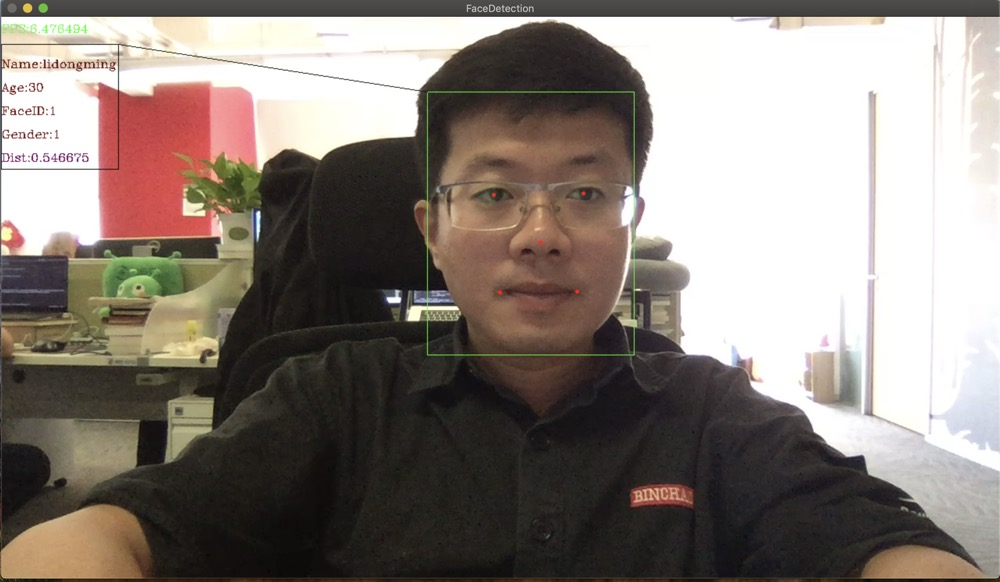
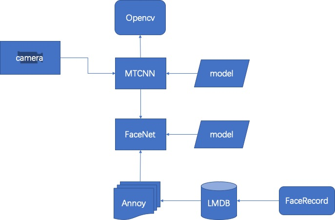

# 人脸识别系统
C++实现的人脸识别系统，基于MTCNN、FaceNet、Tensorflow、Annoy、LMDB等组件实现.

## 项目示例


## 模块


## 环境
已在MacOS上测试并验证, Linux及Windows系统未测试。

## 编译步骤
### 编译Tensorflow
```
1.下载tensorflow源码并切换到需要的版本
git clone https://github.com/tensorflow/tensorflow.git
cd tensorflow
git checkout 版本号

2.安装bazel
不同的系统安装方式不同，具体安装方法略

3.编译Tensorflow
bazel build //tensorflow:libtensorflow_cc.so

4.拷贝编译好的lib并整理头文件,分别放在tf/include及tf/lib路径下
编译生成的lib文件在bazel-bin/tensorflow路径下
依赖的头文件主要包括tensorflow/cc、tensorflow/core下的.h文件，以及third_party、tensorflow/contrib下的头文件
```

### 安装依赖库
```
1.安装glog、gflags、boost、opencv4
2.安装lmdb
git clone https://github.com/LMDB/lmdb.git
make && make install
```

### 编译项目
```
make -j
```

## 运行
```
./bin/faced
```

## 实现原理
### 人脸检测
基于MTCNN进行人脸检测，基于tensorflow c++ api实现的mtcnn，[参考项目](https://github.com/cyberfire/tensorflow-mtcnn "tensorflow_mtcnn")

### 特征提取
基于Facenet进行人脸特征提取，基于tensorflow c++ api实现的facenet，[参考项目](https://github.com/nwesem/facenet_cpp_tensorflow "tensorflow_facenet")

###  特征存储
提取的Embedding向量存储于lmdb中，用c++封装了lmdb接口,见代码lmdb_wrapper.h, face_db.h

### 人脸匹配
基于Annoy库索引Embedding向量并提供高维近似k近邻查找，以加速匹配速度，见代码face_index.h

### 人脸信息展示
匹配人脸成功后，会在界面中显示出此人的信息，比如age、gender等，此信息预先存储在data/face_infos.json

### 功能
1.读取摄像头视频帧并进行人脸识别
配置文件conf/gflags.conf中的--detect_type=0

2.读取本地图像并进行人脸识别
配置文件conf/gflags.conf中的--detect_type=1
读取的图像路径为配置文件中的--test_images_path

3.人脸录入
配置文件conf/gflags.conf中的--detect_type=2
此时会进入人脸信息录入的功能
按'p'会保存人脸并将提取的embedding特征存入lmdb库及annoy库
